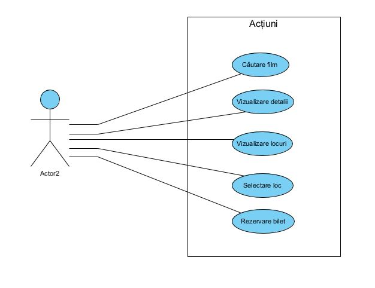
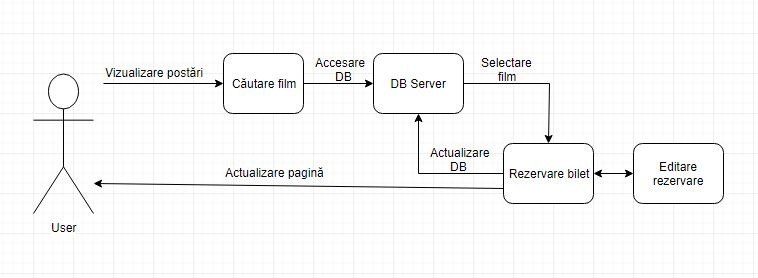
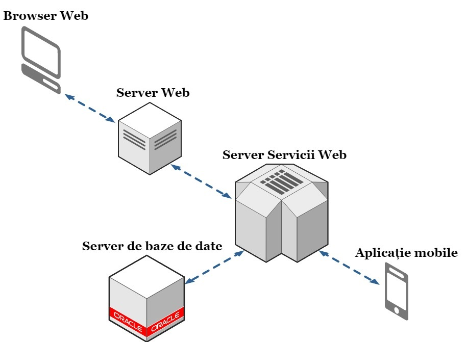
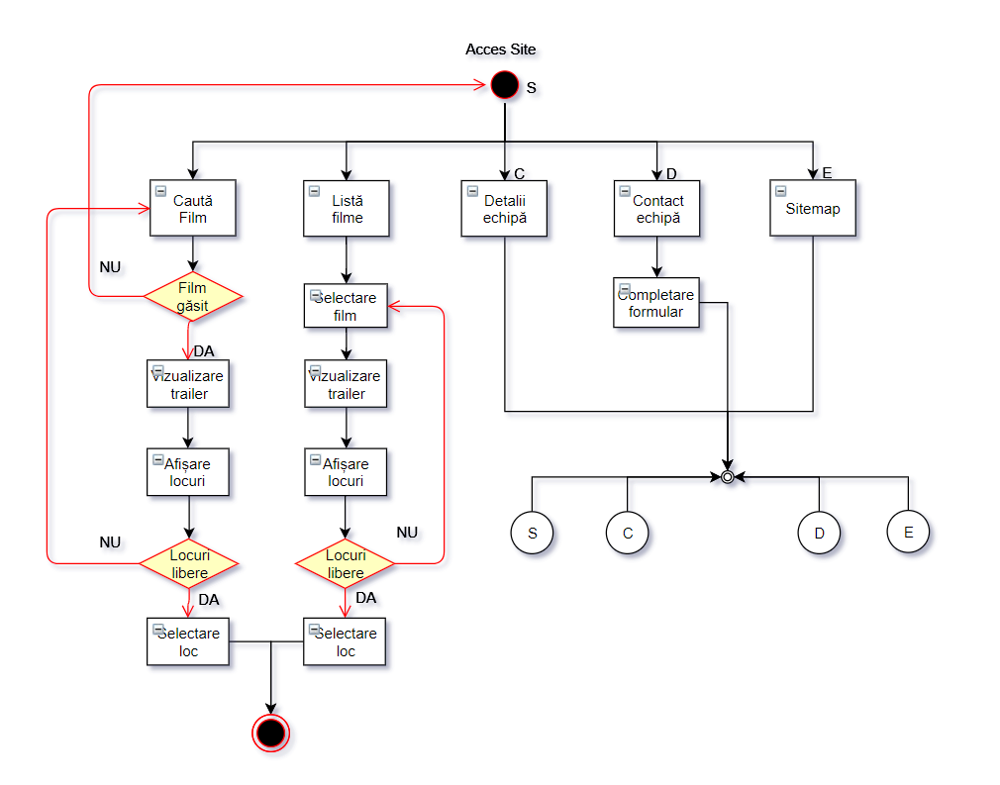
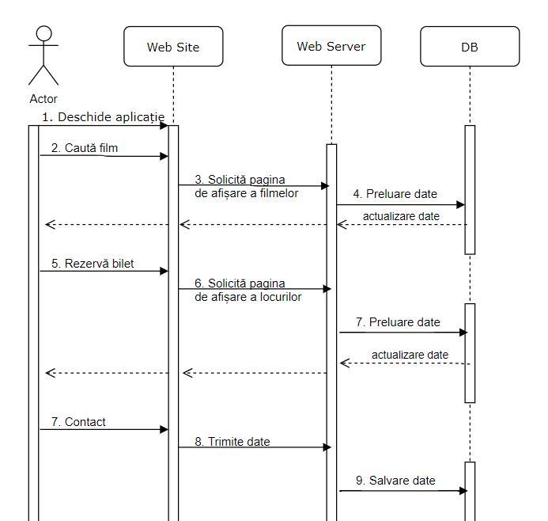
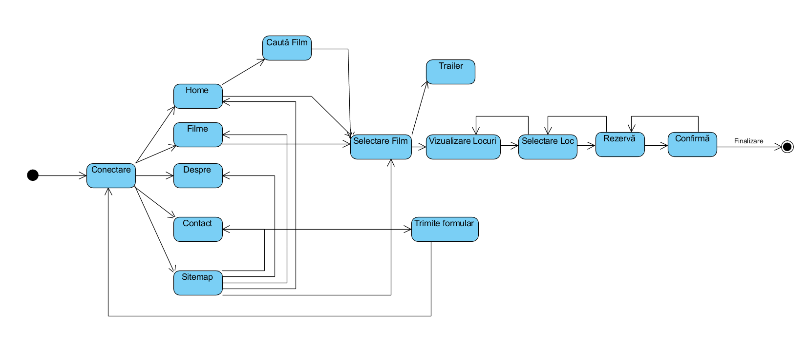
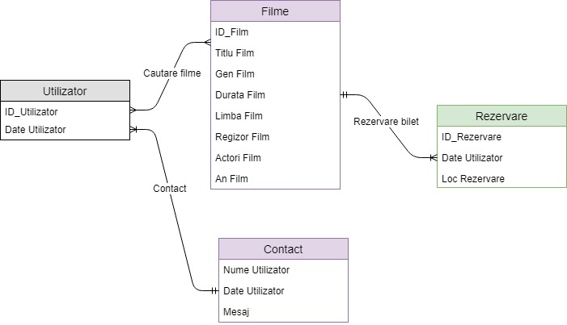

 ---
## ETAPA ÎNTÂI
### 1. Titlul proiectului
####     ------- LumeaFilmelor -------

### 2. Componența echipei de implementare (evidențierea liderului)
   - Grupa 1308B
   - Zavalichi Răzvan-Andrei (lider)
   - Nichita Narcis-Nicolae
   - Bernic Ermil
   
### 3. Prezentarea temei alese + motivația alegerii
 **LumeaFilmelor** este o aplicație ce oferă utilizatorilor posibilitatea de a vedea care sunt ultimele filme apărute și de a rezerva bilete la cinema pentru un anumit film. Am ales această temă datorită faptului că ne plac filmele și am dori să realizăm o aplicație mai prietenoasă pentru pasionații de filme.

### 4. Scurtă analiză a tipurilor de aplicații existente din perspectiva temei alese
Principalele site-uri web care oferă unele din serviciile acestui proiect sunt:
- Cinema City (www.cinemacity.ro);
- Cinema Patria (www.patria.md); 

### 5. Descriere generală a implementării (caracteristici așteptate de la aplicație)
   Aplicația **LumeaFilmelor** oferă posibilitatea de a fi accesată de către orice utilizator, fără a fi nevoie de autentificare. Aceștia pot căuta filmul dorit și iși pot rezerva bilete. Fiecare film este prevăzut cu o scurtă descriere și un trailer.

### 6. Resursele hardware/software utilizate
   #### Resursele hardware și software utilizate pentru crearea aplicației sunt:
-   Laptop/Desktop
-   Eclipse Oxygen
-   Server care folosește servicii web de tip REST
-   Server web (Servlet)
-   Server de baze de date (MySQL)
-   GitHub
-   GitHub Desktop
-   Sublime 3
-   StackEdit
-   Draw io
-   Visual Paradigm

### 7. Identificarea actorilor și a componentelor principale

- **Actorii** acestui site sunt reprezentați de către orice utilizator care va accesa site-ul.
- Componentele principale ale aplicației "LumeaFilmelor" sunt: _server web_, _server de servicii web_, și _server de baze de date_. Ca și prototip de viitor, vom concepe o _aplicație mobil_ pentru comoditatea utilizatorilor.

### 8. Diagrame UML de use-case + Referirea și descrierea în text a fiecărei figuri/diagrame

Diagrama use-case oferă o descriere generală a modului în care va fi utilizat sistemul, furnizează o privire de ansamblu a funcționalităților ce se doresc a fi oferite de sistem și arată cum interacționează sistemul cu utilizatorul.
Utilizatorul are posibilitatea de a căuta filme, a vedea detaliile, poate vizualiza locurile de la cinema, selectează locurile disponibile și poate rezerva bilet.

### 9. Diagrame UML de information flow + Referirea și descrierea în text a fiecărei figuri/diagrame
   
   
   Diagrama information flow este o diagramă UML de comportament care prezintă schimbările de informație între entitățile sistemului la un nivel înalt de abstractizare.
   
### 10. Diagrame UML de componente + Referirea și descrierea în text a fiecărei figuri/diagrame

Diagrama de componente prezintă componentele aplicației și dependențele dintre ele. O componentă este o clasă care reprezintă o parte modulară a unui sistem cu conținut încapsulat. Aplicația **LumeaFilmelor** are ca și componente principale un _server de servicii web_, un _server web_ și un _server de baze de date_. O componentă separată va fi _aplicația mobile_. După cum se poate observa din Diagrama UML de componente am identificat 5 componente care sunt interconectate între ele prin conexiuni de dependență.

### 11. Diagrame UML de activitate + Referirea și descrierea în text a fiecărei figuri/diagrame

Diagrama de activitate prezintă acțiunile pe care le poate realiza un utilizator pe site, împreuna cu tranzițiile posibile și condiționările dintre acestea. Diagrama ilustrează opțiunile posibile după deschiderea site-ului: căutare film, vizualizare trailer, descriere echipă, contact echipă, vizualizare locuri, rezervare loc...

### 12. Diagrame UML de sectență + Referirea și descrierea în text a fiecărei figuri/diagrame 

Diagramele de secvență se concentrează asupra schimbului de mesaje dintre clase, componente, subsisteme sau actori. Aceste elemente se află în partea de sus a diagramei. Mesajele transmise sunt organizate cronologic de sus în jos, reprezentate prin săgeți cu linie continuă, trasate de la sursă la destinație. Mesajele ce reprezintă răspunsuri sunt cu linie întreruptă. 

În diagramele de secvență prezentate, entitățile care schimbă mesaje sunt: utilizatorul, aplicația (web sau Android), serverul de servicii și întreaga bază de date.

### 13. Diagrame UML de stare + Referirea și descrierea în text a fiecărei figuri/diagrame

Diagrama de stare descrisă prezintă stările și tranzițiile pe care le poate parcurge un utilizator.
Atunci când un vizitator intră pe site acesta poate să acceseze fiecare pagină: Home/Detalii/Filme... 
În urma selectării locului dorit pentru un anumit film utilizatorul poate rezerva bilet urmând ca acesta să fie redirecționat către pagina principală.

### 14. Diagrame ER pentru baza de date + Referirea și descrierea în text a fiecărei figuri/diagrame

Diagrama ER (Entitate-Relație) descrisă în ## Diagrama ER pentru baza de date  prezintă tabelele din baza de date și relațiile care se stabilesc între acestea.
Pentru acest proiect se folosesc următoarele tabele:
- Utilizator
- Filme
- Contact
- Rezervare
În aplicația LumaFilmelor este implementată o bază de date cu patru tabele: utilizator, rezervare, filme, contact.
Mai mulți utilizatori pot cauta mai multe filme. Un film poate avea mai multe rezervări. Mai mulți utilizatori se pot adresa catre site cu același formular de contact.

---
## ETAPA A DOUA

##### Pentru etapa a doua a proiectului noi am reusit sa facem :
- am adaugat scheletul aplicatiei noastre:
- LumeaFilmelorCore:
--Filme
--FilmeDAO
- LumeaFilmelorWebServer:
--WebServer :
----AboutMoive
----ShowMoviesList
--LumeaFilmelorWebServer
----MyResources
- LumeaFilmelorWebServices
--lumeafilmelor
----db:
------ListaFilmeDAO
----webservices:
------FilmeFunctii
------MyApplication
--LumeaFilmelorWebServices
----MyResource

-am adaugat fisierele din vechiul proiect "Lumea Filmelor"
-am creat o baza de date(ce contineine o singura tabela momentan);
-am utilizat un server care foloseste servicii web;
-am utilizat un server web care foloseste servlet-uri si JSP-uri;
-am realizat conexiunea intre database,webservices,server si core;
-am folosit javascript pentru a prelua un servlet dintr-un jsp;
-am realizat interfata grafica a site-ului folosind HTML5,CSS si JAVASCRIPT;

#####  Pentru etapa a treia noi vom face:
- afisarea filmelor din baza de date;
- introducerea locurilor ocupate in baza de date;
- afisarea locurilor ocupate din baza de date;
- contact echipa;
- realizarea aplicație Desktop;
- adăugarea tabelelor Contac, ClientCinema
- adăugarea unor noi servleturi
- adăugarea unor servicii web
- modificarea site-ului
-  ...
---
## ETAPA A TREIA
### Probleme speciale/dificultăți întâmpinate:
##### Pe parcurs s-au întâmpinat următoarele probleme ( au fost rezolvate )
- trimiterea datelor de la un servlet la jsp
- trimiterea datelor de la jsp la servlet
- trimiterea și primirea datelor de la javacsript către servlet și JSP
- crearea funcțiilor în java script pentru actualizarea locurilor ocupate

### Contribuții:
- #### Zavalichi Răzvan-Andrei
 -- 1.Creare structură proiect
 -- 2.Realizarea unui schelet funcțional (1 JSP, 1 Servlet, 1 apel la serviciile web)
 -- 3.Creare clasă pentru fiecare tabelă din baza de date
 -- 4.Creare legături între servlet, jsp și serviciile web
 -- 5.Creare legătură cu baza de date cu diferite metode
 -- 6.Adăugarea metodelor GET, POST pentru serviciile web
 -- 7.Creare servlet pentru fiecare pagină web
 -- 8.Creare pagină de wiki
 -- 9.Aplicația desktop în C#
 -- 10.Funcționalități extra: afișare filme (în funcție de caracterele introduse), afișare locuri selectate de către alt utilizator, afișare o nouă sală de cinema pentru fiecare film în parte și actualizarea locurilor disponibile, generare ID scaun în funcție de numărul lui, creare SlideShow în aplicația desktop, validarea tuturor datelor introduse...

- #### Nichita Narcis
 -- 1.Analiza aplicației și descrierea implementării
 -- 2.Diagrame UML de : use-case,information flow,activitate
 -- 3.Populare BD
 -- 4.Conectare la baza de date
 -- 5.Slide Show Aplicație Desktop
 -- 6.Afișare film căutat(site)

- #### Bernic Ermil   
 -- 1.Resurse utilizate
 -- 2.Identificarea actorilor și a componentelor principale
 -- 3.Diagrame UML de componente
 -- 4.Diagrame UML de activitate
 -- 5.Diagrame ER pentru baza de date
 -- 6.Preluare răspuns (format JSON) de la WebServices
 -- 7.Crează tabelele: ClientCinema și Contacte
 -- 8.Salvare Opinie
 -- 9.Salvare informații Client
 -- 10.Adaugă Design responsive

### Aprecieri/Critici
**Lider:** Colegii mei s-au descurcat bine și au rezolvat fiecare task la timp. În caz în care rezolvarea a fost greșită aceștia au intervenit repede cu modificări și au anunțat pe fiecare membru din echipă despre aceste lucruri.
**Narcis:** Liderul nostru Zavalichi Răzvan a distribuit task-urile echitabil și ne-a ajutat mereu atunci cand nu am știut cum să rezolvam unele task-uri.A fost cel mai bun lider pe care l-am fi putut avea ! 
**Ermil:** Atunci când există o echipă nu ar trebui să existe critici, ci doar neînțelegeri ce se rezolvă. Am făcut o echipă bună. Desigur, mulțumiri liderului pentru ca de fiecare dată a avut grijă să ne împartă task-urile proporțional. Totodată, la fiecare impediment întâlnit, ne-a ajutat și a fost foarte receptiv. Narcis, a fost un coleg de ajutor și am făcut o echipă bună toți 3. 

### Concluzii/Modalități de extindere

 - Cu ajutorul acestei aplicație orice utilizator/vizitator poate rezerva bilete online la Cinema.
 - Este diponibilă și versiunea Desktop.
 - Îmbunătățiri pentru aplicație:
 -- Crearea unui tab disponibil pentru administratori
 -- Administratorii pot adăuga/edita/șterge orice film doresc
 -- Posibilitatea utilizatorilor de a viziona filmele online
 -- O interfață mai prietenoasă
 

### Bibliografie
https://stackoverflow.com
https://docs.microsoft.com

© 2018 LumeaFilmelor TEAM. All rights reserved.
