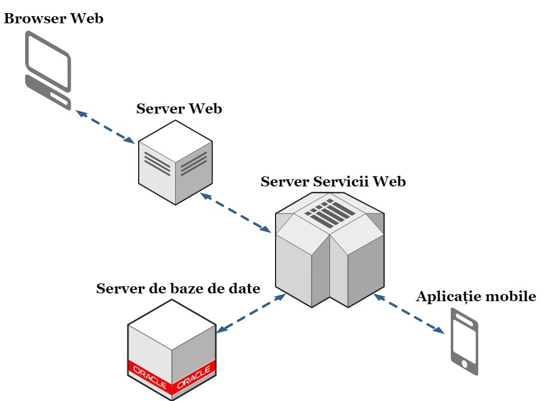
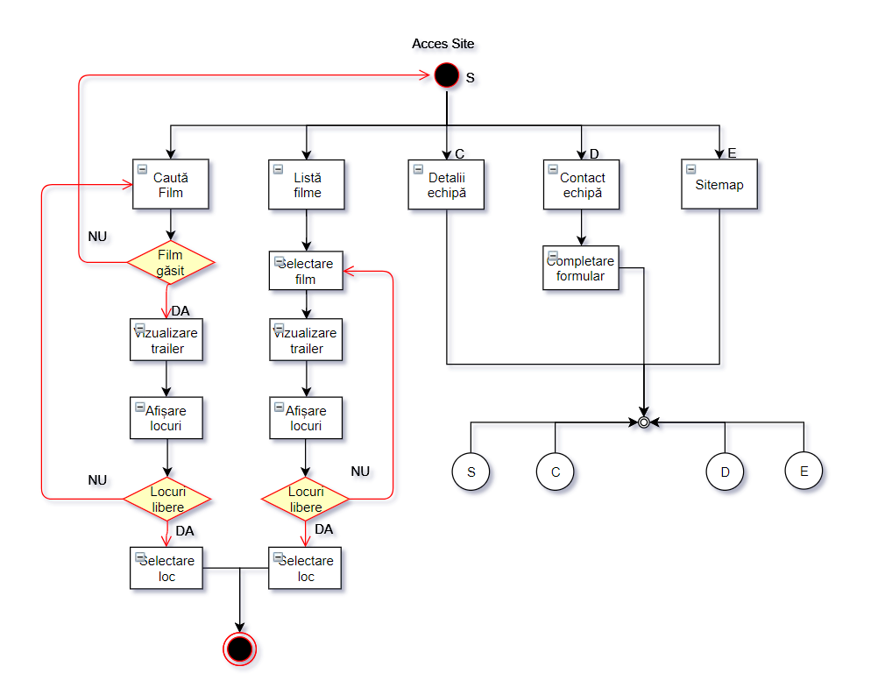

## 1. Titlul proiectului
###     ------- LumeaFilmelor -------

## 2. Componența echipei de implementare (evidențierea liderului)
   - Grupa 1308B
   - Zavalichi Răzvan-Andrei (lider)
   - Nichita Narcis-Nicolae
   - Bernic Ermil
   
## 3. Prezentarea temei alese + motivația alegerii
 **LumeaFilmelor** este o aplicație ce oferă utilizatorilor posibilitatea de a vedea care sunt ultimele filme apărute și de a rezerva bilete la cinema pentru un anumit film. Am ales această temă datorită faptului că ne plac filmele și am dori să realizăm o aplicație mai prietenoasă pentru pasionații de filme.

## 4. Scurtă analiză a tipurilor de aplicații existente din perspectiva temei alese
Principalele site-uri web care oferă unele din serviciile acestui proiect sunt:
- Cinema City (www.cinemacity.ro);
- Cinema Patria (www.patria.md); 

## 5. Descriere generală a implementării (caracteristici așteptate de la aplicație)
   Aplicația **LumeaFilmelor** oferă posibilitatea de a fi accesată de către orice utilizator, fără a fi nevoie de autentificare. Aceștia pot căuta filmul dorit și iși pot rezerva bilete. Fiecare film este prevăzut cu o scurtă descriere și un trailer.

## 6. Resursele hardware/software utilizate
   #### Resursele hardware și software utilizate pentru crearea aplicației sunt:
-   Laptop/Desktop
-   Eclipse Oxygen
-   Server care folosește servicii web de tip REST
-   Server web (Servlet)
-   Server de baze de date (MySQL)
-   GitHub
-   GitHub Desktop
-   Sublime 3
-   StackEdit
-   Draw io
-   Visual Paradigm

## 7. Identificarea actorilor și a componentelor principale

 - **Actorii** acestui site sunt reprezentați de către orice utilizator care va accesa site-ul.
- Aplicația are ca și **componente** principale un _server de servicii web_, un _server web_ și un _server de baze de date_. O componentă separată va fi _aplicația mobile_.

## 8. Diagrame UML de use-case + Referirea și descrierea în text a fiecărei figuri/diagrame

Diagrama use-case oferă o descriere generală a modului în care va fi utilizat sistemul, furnizează o privire de ansamblu a funcționalităților ce se doresc a fi oferite de sistem și arată cum interacționează sistemul cu utilizatorul.

## 9. Diagrame UML de information flow + Referirea și descrierea în text a fiecărei figuri/diagrame
   ### To do

## 10. Diagrame UML de componente + Referirea și descrierea în text a fiecărei figuri/diagrame

Diagrama de componente prezintă componentele proiectului și dependențele dintre ele. Aplicația **LumeaFilmelor** are ca și componente principale un _server de servicii web_, un _server web_ și un _server de baze de date_. O componentă separată va fi _aplicația mobile_.

## 11. Diagrame UML de activitate + Referirea și descrierea în text a fiecărei figuri/diagrame

Diagrama de activitate prezintă acțiunile pe care le poate realiza un utilizator pe site, împreuna cu tranzițiile posibile și condiționările dintre acestea. Diagrama ilustrează opțiunile posibile după deschiderea site-ului: căutare film, vizualizare trailer, descriere echipă, contact echipă, vizualizare locuri, rezervare loc...

## 12. Diagrame UML de sectență + Referirea și descrierea în text a fiecărei figuri/diagrame 

Diagramele de secvență se concentrează asupra schimbului de mesaje dintre clase, componente, subsisteme sau actori. Aceste elemente se află în partea de sus a diagramei. Mesajele transmise sunt organizate cronologic de sus în jos, reprezentate prin săgeți cu linie continuă, trasate de la sursă la destinație. Mesajele ce reprezintă răspunsuri sunt cu linie întreruptă. 

În diagramele de secvență prezentate, entitățile care schimbă mesaje sunt: utilizatorul, aplicația (web sau Android), serverul de servicii și întreaga bază de date.

## 13. Diagrame UML de stare + Referirea și descrierea în text a fiecărei figuri/diagrame

Diagrama de stare descrisă prezintă stările și tranzițiile pe care le poate parcurge un utilizator.
Atunci când un vizitator intră pe site acesta poate să acceseze fiecare pagină: Home/Detalii/Filme... 
În urma selectării locului dorit pentru un anumit film utilizatorul poate rezerva bilet urmând ca acesta să fie redirecționat către pagina principală.

## 14. Diagrame ER pentru baza de date + Referirea și descrierea în text a fiecărei figuri/diagrame
   ### To do
